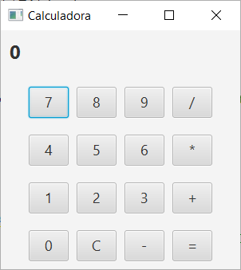
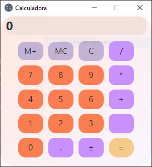

# Práctica 7.2 Calculadora en JavaFX

## Parte 1
Partiendo del ejercicio anterior crea una **calculadora sencilla** en JavaFX utilizando las operaciones habituales (suma, resta, multiplicación y división) así como un botón de reseteo (C):

- Ayúdate para ello del editor de **Scene Builder** y crea un contenedor *VBox* con tantas filas de *HBox* como filas de botoneras vayas a crear, con espacio entre ellas, así como un 'display' superior.
- Ten en cuenta que la división por cero deberá de mostrar un error.

## Parte 2

Mejora la calculadora anterior aplicándole **estilos CSS** para mejorar su apariencia y para que admita la utilización de **decimales** con un botón para ello:

- Agrega estilo y colores mediante *CSS* así como un **icono de aplicación**. Ten en cuenta su **usabilidad/accesibilidad**. 
Se adjunta una captura de ejemplo (no copiar literalmente; usa tu propio estilo basándose en la usabilidad/accesibilidad ya estudiada)

- Agrega un botón para agregar números decimales.

- Deberá de tener también dos botones de **memoria** para almacenar/sumar resultados (*M+*) y otro para borrarlos (*MC*).

- Deberá de tener otro botón para cambiar el **signo** de los operandos en otra fila superior.

> Nota: No olvides generar el fichero *jar* correspondiente para ejecutar la aplicación.

## Pruebas (testing)

| ID Caso Prueba | Descripción Caso de Prueba                         | Entrada            | Salida Esperada | Resultado |
|---------------|-------------------------------------------------|--------------------|----------------|-----------|
| CP-001       | Suma de dos números positivos                    | 5 + 3 =            | 8              |           |
| CP-002       | Suma de número positivo y negativo               | 7 + (-2) =         | 5              |           |
| CP-003       | Resta de dos números                             | 9 - 4 =            | 5              |           |
| CP-004       | Multiplicación de dos números positivos          | 6 * 3 =            | 18             |           |
| CP-005       | Multiplicación con un número negativo            | 4 * (-2) =         | -8             |           |
| CP-006       | División de dos números                          | 8 / 2 =            | 4              |           |
| CP-007       | División entre cero                              | 5 / 0 =            | Error          |           |
| CP-008       | Agregar decimal a un número                      | 3.5                | 3.5            |           |
| CP-009       | Operación con números decimales                  | 2.5 + 1.5 =        | 4.0            |           |
| CP-010       | Borrar resultados                                | 5 + 3, luego C     | Pantalla vacía |           |
| CP-011       | Uso del botón igual sin operación                | =                  | Mismo número   |           |
| CP-012       | Guardar/sumar número en memoria (M+)             | 6, M+              | Memoria = +6   |           |
| CP-013       | Borrar número en memoria (MC)                    | MC                 | Memoria = 0    |           |
| CP-014       | Recuperar número de memoria                      | MR                 | Último valor M |           |
| CP-015       | Cambio de signo positivo a negativo              | 5, +/-             | -5             |           |
| CP-016       | Cambio de signo negativo a positivo              | -7, +/-            | 7              |           |
| CP-017       | Los colores y tamaños de los botones cumplen criterios de usabilidad/accesibilidad    | N/D           |    |      |
| CP-017       | Estructura del proyecto                          | N/D                | Se utiliza la división por paquetes MVC; VistaControlador y Modelo para organizar las clases. |     |
| CP-018       | Comprobación fichero `jar`                       | Proyecto compilado | Se genera y prueba el fichero `jar` empaquetado. |  |
